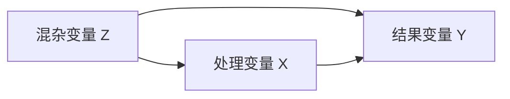

# 配图：截取还是重画

> 本文是 `SKILL.md` §4「其他材料类型」的配图部分展开。**何时读**：要把课件插图放进笔记、或需要重画图表时。

**先记住一条原则**（细节见 §1.10）：图要**贴在它解释的那个公式 / 推导旁边**，逐条对应，
不攒到小节末尾、也不集中在章末。

**路线选择**：能干净裁就裁（§1.6）；裁不干净 / 需要统一风格 / 要把多张合成一张时才重画（§2）。

---

## 1. 把课件图放进笔记

课件里对理解有帮助的结构图（流程图 / 关系图 / 网络结构 / 示意图）应该进笔记，不要只留文字。

**先读库的附件配置**，别自己发明路径：

```bash
cat "<vault>/.obsidian/app.json"
```

- `attachmentFolderPath: "./imgs"` → 附件目录是**笔记同级的 imgs/**（`./` 前缀＝相对于当前笔记所在文件夹）
- `useMarkdownLinks: true` + `newLinkFormat: relative` → 链接写法是 ``，
  **不是** `![[xxx.png]]`。库内还是 0 张图时，这条就是唯一的既定约定
- 文件名**不要带空格**（Markdown 链接里会被编码成 `%20`），用 `{章}-{小节}-{主题}.png`

### 1.1 挑图标准

**只搬帮理解的示意图，不搬装饰性照片**（机器人照片、演示视频封面、数据集里的一堆重复图一律不要）。
搬之前必须逐张看过——名字对不上内容是常事。

**判断尺子：图只回答下面四件事之一才留。**

1. **原理图**：说明某个推导「为什么成立」的结构图（场线 / 受力分解 / 信号流这类）；
2. **题图**：例题的几何 setup（尺寸、角度、路径），不给图就看不懂题；
3. **函数图**：归纳性曲线（某量随另一量变化的趋势）；
4. **概念示意**：区分几种典型情形的示意图。

**默认不要**：实验室演示照片、演示装置示意、封面图、装饰插图——这类图看一眼就懂、
不承载公式，删掉不损失信息。「展示现象」的图（装置 + 现象）默认也不收，只有「展示规律」的图才留；
**使用者明确要求保留时照办**。

### 1.2 深色课件：转 JPEG，先问要不要转白底

**页面底色不是白色时，裁出来就是一块深底图**，放进浅色主题笔记里偏重。
**先问使用者要不要转白底再动手**——盲转换会把白色线条一起吃掉，这个转换应当着使用者的面做。
使用者不要白底时，**保真度优先**。

**深底截图存 PNG 体积很大**（同一张图 PNG 可能是 JPEG 的 3 倍以上）。
**一次裁完统一转 JPEG**，再删掉 PNG：

```python
Image.open(p).convert("RGB").save(new, quality=88, optimize=True)
```

**裁的时候避开页脚**（一般在页面 0.88 H 以下）——否则会把日期、页码、课程名一并框进来。
**遇到载有实质内容的「疑似扫描页」不要跳过**：`疑似扫描页` 只说明「pypdf 抽不出字」，
与「有没有内容」无关。**渲染 → 逐页看图 → 逐页判定**，
把「收了哪页 / 跳了哪页及原因」记进工作日志，下次遇到同一份材料不用重看。

### 1.3 插图必须做「不是空框」体检

这一步不需要视觉也能做，**没做就别往笔记里插**：

```python
from collections import Counter
from PIL import Image
im = Image.open(p).convert("RGB"); px = im.load()
cnt = Counter(); w, h = im.size
for y in range(0, h, 2):
    for x in range(0, w, 2):
        cnt[px[x, y]] += 1
bg, n = cnt.most_common(1)[0]
print(im.size, bg, f"{n/sum(cnt.values())*100:.1f}%", "色彩数", len(cnt))
# 主色占比 > 92% 且色彩数 < 60 → 基本是空框，框选错了
```

正常插图底色占比多在 45%~93%、色彩数数百到数千。

### 1.4 框选：按颜色找面板，别按笔画估

**PPT 课件里插图多半装在一块纯色面板里——按颜色找面板，比按笔画估框准得多。**
已固化为 `scripts/pdf_panels.py`：

```bash
$PY $S/pdf_panels.py "<材料.pdf>" --probe 2-12                     # 各页主色，确认面板颜色
$PY $S/pdf_panels.py "<材料.pdf>" --find 2-12                      # 每页面板框
$PY $S/pdf_panels.py "<材料.pdf>" --crop 2,3,10 --out "<目录>"      # 裁出 PNG
$PY $S/pdf_panels.py "<材料.pdf>" --scan 17,18 --region 440,55,645,175   # 图不在面板里时按亮度找
```

- 按笔画估框容易切掉插图边缘的元素（矢量箭头、微分符号、标号），**按面板裁则一张都不会切边**。
- **别把「页面里的公式高亮框」当成插图面板**——面板检测可能只抓到一个小高亮框。
  **框选结果必须用眼睛复核。**
- **不是所有插图都在面板里**（有的直接画在底色上）。这类图用 `--scan`：
  先目测一个**大致范围**给 `--region`（减少页面文字干扰），它按「比背景亮」找连通域、给出精确包围盒。
  **局限**：只认成片的亮块，对「白线条画在深底上」的图无效——那类只能手工量坐标。
  手工量坐标时务必**先把整页渲染出来看一眼**那个位置有没有别的元素，避免把相邻的公式符号切进来。

### 1.5 优先无损提取内嵌位图，而不是整页裁切

`pdf_layout.py --figs` 会列出该页面积 > 15000 pt² 的位图及其 xref：这类图用
`doc.extract_image(xref)` 能拿到**原生分辨率**，远好过按 dpi 裁切。
同页多张等大的图（如「几种典型情形并列」的三连图）用 PIL 左右拼成一张，比插三张省地方。

**渲染裁切会把幻灯片自己的装饰框进来**（如插图被套一圈装饰边框），而提取原图是干净的。
原生尺寸偏小时统一 ×2 LANCZOS，保证在笔记里显示够大。

**拿不到视觉时，先用页面文字判断图是什么**：页标题写明了「几种……的情形：」、正文又提到三个等大方框
→ 那三张就是那三种情形。这种推断比看像素可靠。

**框选用「完整包围盒」，不要用「最密集处」。** `--figs` 同时给两个框：完整包围盒
（该页所有非模板笔画的并集，按它裁**保证切不到图形**，代价是可能多留一圈底色）、
最密集处（只作参考，常常只是图形的一小部分）。**宁可多留底色。**

### 1.6 路线 A：截取

从 `renderpages.py` 渲染的高 dpi PNG 里裁（`--dpi 130~160` 够用），PIL 裁完**先亲眼看一眼**：

```python
crop = Image.open(page_png).crop((x0, y0, x1, y1))
crop = crop.resize((crop.width * 2, crop.height * 2), Image.LANCZOS)  # 放大再看，模糊立刻现形
```

- 清晰、无遮挡、没裁进别的文字 → 直接用；模糊 / 带水印 / 裁不干净 → 改走重画（§2）

**粗裁 + 自动去白边**，省掉反复调坐标：

```python
crop = page.crop((x0, y0, x1, y1))                 # 先估个大范围
g = np.array(crop.convert("L"))
ys, xs = np.where(g < 240)                          # 非白像素
crop = crop.crop((xs.min()-10, ys.min()-10, xs.max()+10, ys.max()+10))
```

**别让框贴到水印或页码**——去白边之前先确认那一块只有正文图形；框大了会把页脚水印一并框进来，去白边也救不回来。

**页眉装饰横线、贴住的标题标注，一律按颜色擦、不要用矩形。** 矩形会连图一起切掉；
而蓝色标题的墨迹底边可能与图中黑色标注的顶边落在同一 y 值上，任何矩形擦除都必然连带切掉一个。
只擦边缘带、只抹目标色：

```python
blue = (b > 110) & (b - r > 50) & (b - g > 50)
mask = blue.copy()
mask[:, int(w * 0.17):int(w * 0.83)] = False   # 只擦左右边缘，中间的图毫发无损
a[mask] = (255, 255, 255)
```

**别靠目测估比例——直接从 PDF 要几何。** 目测估偏 0.04 就会切进正文或切掉标注。PDF 里有三种确定坐标：

```python
page.get_drawings()      # 每条矢量路径的 rect；并集 = 图形的真实范围
page.get_text("blocks")  # 每个文本块的 bbox —— 这些正是要排除的正文
page.get_image_info()    # 内嵌位图的位置 + xref
```

**只信数字也会翻车**：pymupdf 的文本行框比实际墨迹偏上 0.03~0.04，会把幻灯片标题误判成图内标注。
**定框流程只能是：几何给初值 → 渲染放大目视确认 → 再定。两者缺一不可。**

**裁完每次都要跑三件不需要视觉的自查**：

1. **内容贴边自查**：算内容 bbox，换算回页面比例与保留框比。贴着框边（差 < 0.003）
   ＝ 要么图被切了、要么框外杂物混进来了。
2. **全量边缘扫描**：对输出目录所有图，检查有没有墨迹落在任意边 2 px 内。一次跑完几十张，比逐张肉眼快。
3. **墨带分析**：按行列出墨带 + 主色调，判断「这条是正文还是图内标注」——正文墨量大、横跨整幅；图内标注简短、贴近图形。

```python
ink = (s.sum(axis=2) < 600)          # 墨
blue = (s[:,:,2] > 140) & (s[:,:,0] < 120) & (s[:,:,1] < 120)
rows = np.where(ink.sum(axis=1) > 3)[0]   # 再按 gap > 4 断带，逐带打高度/墨量/跨宽/主色
```

### 1.7 验收与配图核对

**批量验收用 contact sheet**：十几张图逐张看太贵。拼成 3×4 宫格、每格标好文件名，
一张就能扫出边缘残影、切歪、题注被切；只有拿不准的单张才放大看。

**交稿前必须核对「图 ↔ 章节主题」是否对得上。** 文件名相近的图极容易配错——
同族但主题不同的两张图外观相近，回答的却不是本节要讲的区分，图注也会跟着写错。
**拿 `{tag}_shapes.md` 按页搜关键词，确认那一页真有你要的图。**

### 1.8 无视觉时怎么裁图：整页渲染 + 按比例涂白

上面几条都要靠眼睛复核。若当前环境看图时报「不支持图像」（换模型也没用），
改用这套**确定性流程**——它不猜坐标：

1. 先去 `*_shapes.md` 读该页的**文字布局**（哪块标题在左上、哪段字在右下），据此判断图在页面哪半边；
2. `renderpages.py` 整页渲染成 PNG；
3. 按**页面比例**把不需要的区域涂白（用 `(x0,y0,x1,y1)` 四元组描述，各值取 0~1 小数），
   例如涂掉顶部标题 `(0,0,1,0.26)`、底部页码 `(0,0.83,1,1)`、左半文字 `(0,0,0.40,1)`；
4. `white_trim` 按灰度 `bbox` 收紧到内容边界。

比「按像素猜一个 crop 框」稳得多——猜框会反复切到内容或留下大片白边，
而这套流程最坏只多涂一点、少留一点，且比例值可以一次改完重跑。

```python
def white_trim(im, pad=10, tol=246):
    bbox = im.convert("L").point(lambda v: 255 if v < tol else 0).getbbox()
    if not bbox: return im
    x0, y0, x1, y1 = bbox
    return im.crop((max(0,x0-pad), max(0,y0-pad), min(im.width,x1+pad), min(im.height,y1+pad)))
```

透明通道记得先 `flatten` 合成白底，否则 `getbbox` 会把整个 canvas 当成内容。

**尽管这样，还是要在有视觉时回头核对一遍**；动手前**先跟使用者说明白**「这次我看不了图，改用脚本裁」，别默默降级。

### 1.9 用 Mermaid 重画形状图

**PPT 用原生形状画的图没有可导出的图片**（画布上只有 `LINE` 形状 + 文本框）。这类图用
**Mermaid 重画**——Obsidian 原生渲染、可编辑、跟随主题，比位图更好：



判断方法：看 `pptx_deep.py` 产出的 `{tag}_shapes.md`，某页只有 `SHAPE: LINE` 和 `TXT:`、没有 `PIC:`，就是形状画的。

### 1.10 插图位置：贴在它对应的公式/推导旁边

**逐条对应**——不是攒到小节末尾，也不是集中在章末：

- 每张图紧跟**它解释的那个式子/那段推导**，中间只隔一个空行；
- 图下面配一行斜体图注，说清图里哪个量对应公式里的哪个符号；
- 一张图能同时说明好几段时（如汇总性曲线），放在**汇总表之后**而不是正文中间；
- 写新内容时**顺手回看已有章节**，把离公式太远的图挪近。

判断标准：三个月后翻到公式，眼睛往下扫一行就能看到图。

**插入位置用 `replace` 精确控制**（`insert` 只能锚定标题，放不到具体段落后）。
让 **`--anchor` 和 `--until` 是同一行**：

```bash
# content-file 内容 = 该段落原文 + 空行 + 图片行 + 空行 + 图注行
$PY $S/vaultio.py replace "<笔记>" --anchor "<段落原文>" --until "<段落原文>" \
    --content-file "<含图的新内容>" --dry-run
```

`replace` 会把替换块**后面**的空行吃掉再补一个，所以图与下一段之间正好一个空行。
若不想走脚本，也可按文本锚点直接插：

```python
raw = open(NOTE, encoding="utf-8", newline="").read().replace("\r\n", "\n")
assert raw.count(anchor) == 1        # 锚点取该段最后一句，命中数必须为 1，否则跳过并报告
raw = raw.replace(anchor, anchor + f"\n\n", 1)
open(NOTE, "w", encoding="utf-8", newline="\n").write(raw)
```

- 全程 `newline="\n"`，否则整个笔记变 CRLF
- 插完 **diff 备份**：应当只有 `+` 行、**`<` 行数为 0**（证明原有文字一行没动）
- 插完**全量复检引用可达性**，能当场抓出「括号截断」：

```python
refs = re.findall(r'!\[\]\(([^)]*)\)', raw)
for r in refs:
    assert os.path.exists(os.path.join(os.path.dirname(NOTE), r.replace('/', os.sep))), r
# 反向查孤儿图：set(os.listdir('imgs')) - {basename of refs}
```

### 1.11 文件名禁用括号

`f(-2t+1).png` 写成 `.png)` 时，
**Markdown 在第一个 `)` 就结束链接**，图裂开、path 只剩一半。
`sinc(t)`、`G_T(t)`、`δ'(t)` 同理。一律用 `ch1-1.3-综合变换.png` 这种无括号命名。

### 1.12 绘图脚本归档

重画或批处理的脚本统一放 `imgs/make_figs.py`，脚本里
`OUT = os.path.dirname(os.path.abspath(__file__))`，丢进 `imgs/` 跑就原地重新生成，
下次改图直接改脚本重跑。

## 2. 重画图表（路线 B）

### 2.1 判断尺子：拿不准就问三个问题

1. **能不能干净地裁出来？** 裁完还带水印、页脚、页码、相邻文字残影 → 重画。
2. **重画会不会丢信息？** 图里有真实照片、复杂结构、密集标注（装置图、系统方框图、三维示意）→ 截取。
   用代码画这些既费时又容易画错。
3. **是不是一组要对照的图？** 统一样式的成套对比（多步变换、几种情形并列）→ 重画，
   截取拼不出这种一致感；**零散单张 → 截取更划算**。

**默认倾向：能干净裁就裁，裁不干净 / 需要统一风格 / 要把多张合成一张时才重画。**
数学曲线常落在第三条（一章的波形图往往要成套对比）所以重画比例高——但**这不是铁律**。
**先逐张判断，再动手**，别一上来就套「全部重画」的模板。

### 2.2 重画的九条硬要求

1. **中文字体必须显式设置**，否则全是方框。在脚本顶部定成常量，换平台只改这一行：
   ```python
   FONT = "Microsoft YaHei"        # macOS: "PingFang SC"    Linux: "Noto Sans CJK SC"
   plt.rcParams["font.sans-serif"] = [FONT, "sans-serif"]
   plt.rcParams["axes.unicode_minus"] = False
   ```
2. **画成带箭头的数学坐标轴**（`annotate` + `arrowstyle="-|>"`），比默认方框更像教材。
   输出 `dpi=190`、`bbox_inches="tight"`、白底；单张 20–110 KB 正常。
3. **配色统一**，同样在脚本顶部定一次、全脚本引用：
   ```python
   BLUE, RED, GREY, GREEN = "#1f6fd0", "#d62728", "#999999", "#2e9e5b"   # 主色 / 对照 / 辅助 / 标注
   ```
4. **上下标一律用 mathtext，别直接敲 Unicode 下标字符**（`a₁`、`k₃`）。
   常见中文字体（Microsoft YaHei、PingFang SC 等）**没有下标字形**，渲染时静默变成空框，
   只在 stderr 丢一条 `UserWarning: Glyph 8321 missing`。写成 `"$a_1$"`、`"$k_3$"` 即可。
   **首次生成后必须查一遍字形警告，一条都不能放过**：
   ```bash
   python make_figs.py 2>&1 | grep -i "glyph\|warn"
   ```
5. **结构类图（框图、流程图、存储布局这类）不是坐标曲线，别硬套轴坐标**：
   `ax.axis("off")` + `Rectangle` / `FancyArrowPatch` 手工摆图元更好画，
   同样要 `bbox_inches="tight"` + 白底。多面板用 `plt.subplots(1, n)` 平铺。
6. **`xlim` / `ylim` 必须覆盖所有图元的坐标，画之前先算一遍 min/max**：
   只凭感觉给范围，超出的图元会被**静默裁掉**（生成日志里一条警告都没有，只有看图才发现）。
   定完布局后立刻自检：把所有图元用到的 x/y 极值（含箭头终点）列出来，确认落在 `xlim` / `ylim` 内；
   左右各留 0.2–0.5 个格宽作边距，别让格子贴边被 `tight` 裁掉线框。
7. **手工摆图元要用「固定坐标表」，不要层层相对累加**：
   写 `x3 = x2 + 3*W + 0.3` 这种链式推位，一旦中间某个量算错，后面**整片错位**。
   正解是先定一张常量表，画每一层时按表查坐标：
   ```python
   COL = {1: 1.5, 2: 4.2, 3: 6.9, 4: 9.6, 5: 12.3, 6: 15.0, 7: 17.7}   # 第 n 列的 x
   ROW = {0: 2.95, 1: 1.55, 2: 0.35, 3: -0.85, 4: -2.05}              # 第 n 层的 y
   ```
   所有结点自然对齐，改一层也不会牵动别的层。多行数据用 `for r, vals in enumerate(rows)`
   + 单调递减的 y，比手写每行 y 更不易错。
8. **多子图时图例别用 `bbox_to_anchor` 往轴外挂**：`bbox_inches="tight"` 对 `ax.legend`
   的锚定框处理不可靠，图例可能被整段裁掉。宁可 `loc="lower right"` 留在轴内，
   或用 `loc="lower center"` + `bbox_to_anchor=(0.5, -0.03)` 并留足下方余量。
9. **收尾扫一遍「调试残留」**：改图过程中加的临时箭头 / 参考线很容易忘删，
   看图时会表现为「凭空一道线穿过某个结点」。**每张图看过通过后，再回代码搜一遍
   画箭头/辅助线的调用，数一数是否都对得上。**

### 2.3 重画的图必须逐张看过核对

**重画图不能用宫格验收偷懒**：宫格缩小后标签重叠看不出来，而标签重叠正是重画最常见的毛病。
张数不多（≤8 张）时逐张看过最稳。常见三类症状：

| 症状 | 原因 | 对策 |
| --- | --- | --- |
| 同一位置的两个标签叠成一团 | 两个图元指向同一位置，文字落点重合 | 多个标签**纵向错行**（`dy` 只作用于文字，箭头位置不动） |
| 文字被箭头顶端划穿 | 箭头 `mutation_scale` 的本体比线段长，侵占了文字行 | 箭头与文字之间至少留 0.15 个数据单位 |
| 右侧说明文字压住图元 | 用固定 `x` 偏移摆文字，没算左边图元实际宽度 | 说明文字宁可**换行放到图元下方**，也别往右硬排 |

**更省事的通用解法：同位置的标签直接用 `legend`，别就地写在图上。**
两条曲线的就地标签在「两图形完全重合」的子图里必然叠成一团，改用每个子图左上角的图例一次解决：

```python
ax.legend(handles=[plt.Line2D([], [], color=BLUE, lw=1.7),
                   plt.Line2D([], [], color=RED, lw=1.7)],
          labels=["曲线 A", "曲线 B"], fontsize=7.8,
          loc="upper left", frameon=False, handlelength=1.3,
          labelspacing=0.25, borderpad=0.1, handletextpad=0.5)
```

**整段说明文字压住曲线**时，把它移到**结果曲线外侧的空白区**（如曲线右方，相应放宽 `xlim` 给它腾地方），
别往曲线上排。

### 2.4 重画曲线必须用像素分析核对课件原图

**不要凭目测复刻课件曲线。** 目测会把「斜线升到顶再垂直落」看成梯形，出的图看着对、实际错。
像素分析只要两三分钟：

```python
red = (R>170) & (G<120) & (B<120)      # 1. 按颜色分离曲线像素
# 2. 逐列扫描：像素数暴增的列 = 垂直段；y 值稳定的列 = 水平段
# 3. 蓝色 mask 的行峰值 = x 轴像素 y；列峰值 = y 轴像素 x
# 4. 绿色 mask 在轴附近的竖线中心 = 刻度位置 → 算出「1 单位 = 多少像素」
# 5. 用「y 轴像素 x ↔ 原点」+「刻度间距」反推每个拐点的真实坐标
```

像素分析能同时定出横纵方向的「1 单位 = 多少像素」并逐一自洽——**目测量不出来**。

---

